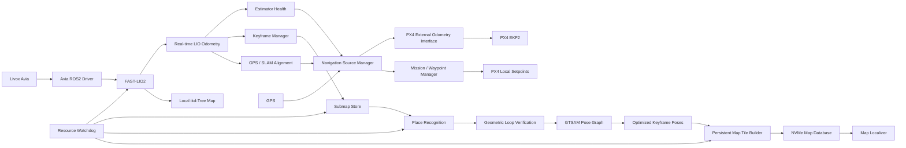

# Livox Avia GPS-Denied UAV Navigation + FAST-LIO2 + Persistent SLAM

**Target platform:** Livox Avia + Jetson Orin Nano Super + PX4/Cube Orange-class flight controller  
**ROS:** ROS 2 Jazzy / Ubuntu 24.04  
**Primary estimator:** FAST-LIO2  
**Backend:** keyframe/submap manager + LiDAR place recognition + GTSAM pose graph  
**Flight interface:** PX4 external-vision odometry through MAVLink `ODOMETRY` or the equivalent ROS 2 PX4 interface  
**Persistent storage:** Jetson external NVMe  
**Mission:** operator-controlled or Jetson waypoint mission, with GPS-denied continuation when estimator health is valid

> Implementation principle: FAST-LIO2 is the real-time localization front end. The persistent map, loop closure, GPS alignment, map loading, and mission logic must run around it without blocking the FAST-LIO2 state-estimation thread.

---

## 0. What Antigravity should build

Build a **GPS-optional navigation stack**, not a single monolithic SLAM node.

The desired behavior is:

1. Livox Avia continuously provides LiDAR + time information and its IMU stream.
2. FAST-LIO2 performs tightly coupled LiDAR-inertial odometry and maintains the real-time local map.
3. A separate keyframe/submap service stores compact keyframes and builds the persistent map in the background.
4. A separate loop-closure backend detects revisits, geometrically verifies them, adds robust graph factors, and optimizes the pose graph.
5. The optimized pose graph regenerates the stitched map from immutable submaps; never “warps” the only copy of a global cloud in memory.
6. A localization-quality node publishes pose + velocity + covariance + health state to PX4.
7. A navigation-source manager monitors GPS and SLAM simultaneously. GPS can be primary when valid; SLAM remains warm and continues mapping. During GPS loss or suspected spoofing, SLAM can become the external position source.
8. A map server keeps only the active map working set in RAM and pages persistent map tiles from NVMe.
9. A Jetson mission manager stores the waypoint mission in local-map coordinates and sends setpoints to PX4 only when the required estimator is healthy.
10. A watchdog protects the real-time estimator from RAM exhaustion, CPU starvation, stale timestamps, queue growth, and bad loop closures.

---

## 1. Important audit result: do NOT turn the existing radar `slam_node.py` into the Livox SLAM core

The uploaded `slam_node.py` is explicitly a **dense 4D radar SLAM front end for Linpowave U300-class radar**, not a Livox LiDAR implementation. It consumes UDP packets with `(x,y,z,v)` radar data, uses a radar-specific tilt transform, optional RIO velocity, IMU deskewing, Open3D GICP, and an altimeter-specific Z constraint.

Therefore:

- Keep it as a **separate radar experiment/reference**.
- Do not place its GICP/tilt/gravity/Z-clamp logic inside FAST-LIO2.
- Do not feed radar RIO velocity into FAST-LIO2 as though it were LiDAR-inertial odometry.
- Reuse only generic engineering ideas such as health reporting, reject reasons, logging, and packet/versioning if useful.
- For the LiDAR system, FAST-LIO2 owns the 6-DoF state estimate.

### Existing radar-node issues that make it unsuitable as the Livox production estimator

1. It is written around radar packets and radar Doppler/RIO inputs.
2. `TiltMount` contains radar-frame-specific axis permutations and a mechanical tilt model.
3. `_gravity_correct()` deliberately forces the estimated pose to a level yaw-only orientation and separately injects an AGL measurement. That is a special-case stabilization technique, not a general LiDAR SLAM state model.
4. The default runtime `--theta-tilt-deg` is `90.0`, while the dataclass default is `40.0`; the code itself warns that the production value must be bench-measured.
5. The SLAM core uses Open3D GICP and a local ten-keyframe cloud, whereas FAST-LIO2 is designed around its tightly coupled LiDAR-IMU filter and incremental ikd-Tree map.
6. The global map is randomly reduced to a maximum point count. That is unsuitable for a deterministic persistent survey map.
7. There is **no loop-closure backend** in this file.
8. The outgoing pose packet is a custom UDP packet, not a standard flight-estimator interface with full covariance semantics.

Use the uploaded radar node only as a reference for software-health instrumentation. The production LiDAR estimator should be FAST-LIO2.

---

## 2. Hardware architecture

### 2.1 Required core hardware

- **Livox Avia** LiDAR.
- **Jetson Orin Nano Super**, 8 GB LPDDR5.
- **PX4 flight controller** (Cube Orange / Cube Orange+ class).
- Reliable Ethernet between Avia and Jetson.
- External NVMe on the Jetson for persistent maps, logs, pose graphs, and rosbag2 recordings.

### 2.2 IMU policy

The Livox Avia has a built-in IMU. FAST-LIO2 also stresses that LiDAR/IMU synchronization is important because per-point timing is used for motion undistortion.

**Preferred first implementation:** use the Avia's own LiDAR+IMU stream as the sensor pair consumed by FAST-LIO2. Keep the flight-controller IMU independent for PX4 stabilization.

The BNO085 or flight-controller IMU may be used by the navigation stack for auxiliary attitude/health information only after its time offset, axis convention, and extrinsics are measured. Do not mix multiple IMUs into FAST-LIO2 just because they are available.

### 2.3 Why the Avia's FOV matters

Livox lists the Avia non-repetitive scanning FOV as **70.4° horizontal × 77.2° vertical**; repetitive line scanning is **70.4° × 4.5°**. The sensor is rated at 240k/480k/720k points/s depending on return mode, with maximum detection range varying by reflectivity and ambient light.

This is very different from a 360° spinning LiDAR. The loop-closure design must therefore use **accumulated submaps / partial-FOV place recognition**, not assume that a single Avia frame is a full 360° Scan Context scan.

---

## 3. ROS 2 package architecture

Use C++ for the high-rate estimation/backend path. Use Python mainly for orchestration, health monitoring, analysis, map-management utilities, and mission configuration.

```text
ros2_ws/src/
├── livox_ros2_avia/                 # ORIGINAL AVIA driver already validated by current setup
├── FAST_LIO_ROS2/                   # FAST-LIO2 ROS2 fork used by current setup
├── gps_denied_nav/
│   ├── avia_fastlio_adapter/        # topic/frame adapter; no heavy processing
│   ├── lio_output_adapter/          # Odometry + covariance + health
│   ├── keyframe_manager/            # keyframe selection and submap formation
│   ├── map_backend/                 # persistent tile store + map manifest
│   ├── loop_closure/                # place recognition + geometric verification
│   ├── pose_graph_backend/          # GTSAM optimization
│   ├── map_localizer/               # localization against an existing saved map
│   ├── gps_alignment/               # SLAM-map <-> GPS/NED alignment
│   ├── nav_source_manager/          # GPS / SLAM / degraded-state logic
│   ├── px4_bridge/                  # MAVLink ODOMETRY or PX4 ROS2 bridge
│   ├── waypoint_manager/            # local-frame mission + waypoint setpoints
│   ├── altitude_estimator/          # optional LiDAR-ground AGL estimator
│   ├── safety_supervisor/           # watchdogs, health, resource guards
│   └── telemetry_logger/            # diagnostics + rosbag2 + health log
└── third_party/
    ├── gtsam/                       # pinned version
    └── scan_context/                # pinned place-recognition implementation
```

---

## 4. Dependencies Antigravity should import/install

### 4.1 ROS 2 / system dependencies

```bash
sudo apt update
sudo apt install -y \
  build-essential cmake git pkg-config \
  libeigen3-dev libpcl-dev \
  ros-jazzy-pcl-ros \
  ros-jazzy-pcl-conversions \
  ros-jazzy-tf2 \
  ros-jazzy-tf2-ros \
  ros-jazzy-tf2-eigen \
  ros-jazzy-sensor-msgs \
  ros-jazzy-nav-msgs \
  ros-jazzy-geometry-msgs \
  ros-jazzy-diagnostic-updater \
  ros-jazzy-rosbag2 \
  ros-jazzy-rosbag2-storage-mcap
```

Add the exact packages required by the selected FAST-LIO2 fork with:

```bash
rosdep install --from-paths src --ignore-src -r -y
```

### 4.2 Livox driver baseline

The current uploaded guide uses:

- `ASIG-X/livox_ros2_avia`
- Ubuntu 24.04 / ROS 2 Jazzy patching
- patched Livox SDK compilation
- custom `livox_interfaces` message integration

Freeze this known-good setup before changing the driver.

Do **not** automatically replace the working original-Avia driver with a different driver merely because a newer Livox ROS2 driver exists. The current official Livox driver documentation supports ROS 2 Jazzy but its currently listed supported products include Avia2 rather than explicitly listing the original Avia. The ASIG-X Avia repository, in contrast, is specifically for the original Avia but documents ROS 2 Humble. Treat the current patched original-Avia setup as a pinned baseline and migrate only after a separate test campaign.

### 4.3 FAST-LIO2

Use the current FAST-LIO2 ROS2 fork already used by the working mapping setup, with a **pinned commit hash** stored in `third_party/manifest.yaml`.

Do not rely on “latest main” for a flight build.

### 4.4 Loop-closure dependencies

Use:

- GTSAM for the pose graph.
- Scan Context or a FOV-aware derivative for place recognition.
- PCL/Eigen/nanoflann for geometric verification and nearest-neighbor work.

Do not copy SC-LIO-SAM wholesale into the system. Port the useful ideas (global place recognition + local geometric verification + robust loop factors) into a ROS 2 backend that consumes FAST-LIO2 keyframes.

---

## 5. Core dataflow



---

## 6. FAST-LIO2 responsibilities

FAST-LIO2 should own:

- LiDAR-IMU synchronization.
- IMU propagation.
- LiDAR update.
- Motion undistortion using point-level timing.
- Real-time local pose.
- Real-time velocity.
- Local incremental map.
- Real-time odometry covariance/quality extraction.

FAST-LIO2 should **not** own:

- Persistent multi-session map storage.
- Global pose graph optimization.
- GPS source selection.
- Mission planning.
- Map database indexing.
- Loop-closure map rewriting.
- OOM/resource supervision.

The official FAST-LIO2 paper describes direct registration of raw points to an incremental ikd-Tree map and explicitly includes Livox Avia and UAV use cases. Use that architecture as the real-time front end rather than replacing it with Python/Open3D GICP.

---

## 7. Live map versus persistent map

### 7.1 Live working set

The real-time estimator should maintain only the map needed for tracking.

Initial target:

- local radius: ~30–60 m around current pose;
- live voxel size: start around 0.15–0.25 m and benchmark;
- keep enough structure for reliable registration but do not chase the prettiest possible point cloud;
- never enable “100% of all raw points” merely to make the visualization dense.

The uploaded mapping guide's `filter_size_map: 0.1` and `point_filter_num: 1` are useful as a **dense mapping experiment**, but the navigation build must be benchmarked separately because the live estimator and the persistent survey map have different objectives.

### 7.2 Persistent map

Do not store the entire global cloud as one ever-growing Python/Open3D object.

Store:

```text
mission_map/
├── manifest.yaml
├── map.sqlite3
├── keyframes/
│   ├── kf_000001.bin
│   ├── kf_000002.bin
│   └── ...
├── tiles/
│   ├── tile_000_000_000.bin
│   ├── tile_000_000_001.bin
│   └── ...
├── descriptors/
│   ├── sc_000001.bin
│   └── ...
├── graph/
│   ├── nodes.bin
│   ├── edges.bin
│   └── optimized_poses.bin
└── checksums.sha256
```

Recommended geometry storage for the flight system: compact binary float32 point blocks or compressed PCD/LAZ-like structures. PCD remains useful for interoperability and debugging.

### 7.3 Map stitching rule

**Never stitch by simple point-cloud concatenation.**

Instead:

1. Create immutable keyframe/submap clouds.
2. Maintain a pose for every keyframe.
3. Add odometry edges from FAST-LIO2.
4. Add loop-closure edges only after geometric verification.
5. Optimize the pose graph.
6. Re-render all affected tiles from the optimized keyframe poses.
7. Atomically update the map manifest.

This makes loop closure deterministic and reversible.

---

## 8. Keyframe/submap manager

Create a keyframe when one of these conditions occurs:

- translation exceeds a starting threshold of ~0.5 m;
- yaw/rotation exceeds a starting threshold of ~5°;
- a maximum time interval is reached;
- the current environment changes enough to produce a useful new descriptor.

Tune these numbers from real Avia flight logs.

Each keyframe should contain:

```text
keyframe_id
monotonic_timestamp
pose_SE3
velocity
pose_covariance
velocity_covariance
point_count
voxel_resolution
FAST_LIO_quality
submap_id
scan_descriptor_id
GPS_at_capture (optional)
GPS_quality (optional)
```

A **submap** should contain multiple keyframes, for example 1–3 seconds of flight or a configurable 5–20 m spatial window. For the Avia, submaps are especially useful because one raw frame has limited FOV.

---

## 9. Loop closure design for Livox Avia

### Problem

Standard Scan Context is especially convenient with broad/360° LiDAR coverage. The Avia has a limited FOV, so a single frame can be ambiguous.

### Production strategy

Use **submap-level place recognition**:

1. accumulate several Avia keyframes into a local submap;
2. voxelize the submap to a stable resolution;
3. build a place descriptor from the accumulated geometry;
4. search the persistent descriptor index for candidates;
5. reject candidates that are too close in temporal sequence;
6. perform coarse geometric registration;
7. perform fine ICP/GICP/NDT verification;
8. compute a loop constraint covariance / confidence;
9. add a robust factor to GTSAM;
10. optimize only when the factor is sufficiently trustworthy.

### Loop-closure acceptance gate

A loop factor should require multiple checks, not descriptor similarity alone:

```text
candidate descriptor score  -> pass
        AND
coarse registration success  -> pass
        AND
fine registration residual    -> pass
        AND
sufficient overlap            -> pass
        AND
pose jump consistent          -> pass
        AND
robust-kernel residual        -> pass
```

Use a robust loss on loop factors. A wrong loop closure is more dangerous to a map than having no loop closure.

---

## 10. Existing-map localization / “refer to Jetson map”

Implement a separate `map_localizer`.

### Startup behavior

The Jetson should support:

**A. New mission / new map**

```text
load empty mission
-> FAST-LIO2 starts
-> map building starts
```

**B. Known area / existing map**

```text
load manifest
-> load descriptor index
-> keep only nearby map tiles in RAM
-> FAST-LIO2 starts local odometry
-> place recognizer finds candidate saved submap
-> geometric alignment establishes map pose
-> map_localizer begins map tracking
```

This means the saved map is used for **relocalization and global consistency**, while FAST-LIO2 remains responsible for the high-rate local state.

Do not load the entire map into RAM at mission start.

---

## 11. GPS / SLAM source-management architecture

### 11.1 Never use “GPS acquired = trustworthy”

Treat GPS as a sensor with a health state.

States:

```text
NO_GPS
GPS_ACQUIRING
GPS_VALID
GPS_SUSPECT
GPS_LOST
```

SLAM states:

```text
LIO_INIT
LIO_VALID
LIO_DEGRADED
LIO_LOST
RELOCALIZING
```

Navigation-source states:

```text
GPS_PRIMARY
SLAM_PRIMARY
GPS_AND_SLAM_MONITORING
DEGRADED_POSITION
POSITION_UNAVAILABLE
```

### 11.2 GPS-versus-SLAM consistency

Maintain a transform between the local SLAM frame and the local NED/GPS frame.

For a GPS measurement:

```text
p_gps_ned          = GPS local NED position
p_slam_map         = FAST-LIO2 position
T_ned_map          = current map -> NED alignment
p_slam_ned         = T_ned_map * p_slam_map
r                  = p_gps_ned - p_slam_ned
```

Monitor the residual together with the respective covariance.

Start with a statistically motivated consistency gate rather than a single hard-coded distance. A practical initial test is a normalized residual gate around 3-sigma, evaluated over several consecutive samples, and then tuned from recorded GPS-loss/spoof test logs.

### 11.3 GPS valid

When GPS is healthy:

- GPS can remain the absolute reference for PX4.
- FAST-LIO2 continues running.
- keyframes continue being built.
- loop closure continues.
- the map continues being updated.
- GPS position can be recorded against SLAM keyframes.

### 11.4 GPS loss

When GPS becomes invalid:

- do NOT kill FAST-LIO2;
- do NOT reset the map;
- freeze the last valid GPS-to-map alignment;
- let SLAM continue locally;
- feed the validated external odometry to PX4 according to the configured EKF2 external-vision setup.

### 11.5 GPS suspected spoofing

If GPS disagrees materially with a healthy SLAM solution:

- mark GPS `SUSPECT`, not `VALID`;
- do not snap the SLAM map to the GPS position;
- continue SLAM as the trusted local estimate while logging the discrepancy;
- allow GPS to return to `VALID` only after a stability window and consistency test.

### 11.6 GPS reacquisition

Never jump the aircraft's reported position by replacing the SLAM pose with a new GPS coordinate in one frame.

Instead:

1. confirm GPS stability for a window;
2. estimate the new map-to-NED alignment;
3. compare it against the existing transform;
4. if consistent, update the alignment gradually / through the estimator rather than a hard pose jump;
5. restore GPS as the absolute reference.

---

## 12. PX4 integration

Use standard external-vision odometry semantics.

Preferred measurement payload:

```text
position
orientation
linear velocity
pose covariance
velocity covariance
timestamp
frame convention
sensor offset / extrinsics
quality status
```

For MAVLink integration, prefer **`ODOMETRY`** rather than a minimal custom packet because PX4 can consume pose/velocity and covariance information from external vision.

The existing radar node's custom UDP pose format must not be reused as the final PX4 interface.

### Frame conversion

Be explicit:

```text
ROS default: ENU / FLU
PX4 estimator: NED / FRD
```

Implement exactly one tested conversion module:

```text
frame_converter.cpp
```

and unit-test:

- identity case;
- 90° yaw;
- roll/pitch sign;
- velocity sign;
- quaternion conversion;
- covariance transformation.

### PX4 configuration philosophy

PX4 EKF2 supports external-vision position, velocity, orientation and vertical fusion, and accepts uncertainty information through covariance fields in the MAVLink ODOMETRY message. The exact `EKF2_EV_CTRL`, `EKF2_HGT_REF`, `EKF2_EV_DELAY`, and sensor-extrinsic values must be tuned on the actual aircraft.

Do not hard-code a flight parameter set into the software repository without recording the PX4 firmware version and aircraft calibration state.

---

## 13. Waypoint mission architecture

The Jetson owns the mission description, but PX4 owns the low-level flight controllers.

### Mission representation

Store waypoints in the local SLAM/map frame:

```yaml
mission_id: demo_001
frame: map
waypoints:
  - [x, y, z, yaw]
  - [x, y, z, yaw]
  - [x, y, z, yaw]
```

The mission manager converts:

```text
map waypoint
    -> current map/NED transform
    -> PX4 local NED trajectory setpoint
```

When GPS is absent, the waypoint manager continues in local coordinates.

When GPS is available, the same mission can be associated with the GPS-aligned frame.

### Offboard watchdog

PX4 requires a continuous offboard-control signal. The Jetson must therefore have an independent setpoint publisher/watchdog that cannot be blocked by loop closure or map I/O.

The mission planner must never wait on:

- map compression;
- loop closure;
- disk writes;
- CloudCompare export;
- Python analysis;
- visualization.

---

## 14. Height / AGL estimation

Separate **pose Z** from **absolute AGL**.

FAST-LIO2 gives relative 3D motion. It is not, by itself, a guaranteed absolute altitude sensor.

Implement:

```text
AGL estimator
├── preferred: independent downward range measurement
└── optional: LiDAR ground-plane estimate from Avia
```

### LiDAR-only AGL fallback

When ground is visible:

1. transform Avia points into the stabilized body/world frame;
2. reject outliers;
3. estimate the dominant ground plane;
4. use IMU roll/pitch to calculate perpendicular distance to the plane;
5. publish AGL + confidence.

Reject the estimate when:

- too few ground points;
- vegetation dominates;
- water / reflective surface creates instability;
- ground normal changes too quickly;
- plane residual is high.

Do not make LiDAR-plane AGL the sole safety height source until it has been validated over the actual terrain classes.

---

## 15. Jetson Orin Nano Super resource plan

NVIDIA specifies the Orin Nano Super at up to 67 INT8 TOPS, 8 GB LPDDR5 and 102 GB/s memory bandwidth. It is therefore capable of a multi-process robotics stack, but the 8 GB shared-memory budget still requires discipline.

### Initial memory budget

| Subsystem | Target RAM envelope | Priority |
|---|---:|---|
| FAST-LIO2 + live ikd-Tree | 1.5–2.0 GB | CRITICAL |
| Livox driver + ROS middleware | 0.4–0.6 GB | CRITICAL |
| PX4 bridge + navigation state | 0.2–0.4 GB | CRITICAL |
| Active keyframes + live submaps | 0.6–1.0 GB | HIGH |
| Loop-closure / GTSAM backend | 0.4–0.8 GB | MEDIUM |
| Map tile cache | 0.3–0.7 GB | MEDIUM |
| Logging / rosbag2 buffers | 0.2–0.4 GB | LOW |
| Mission / supervisor / diagnostics | 0.2–0.3 GB | HIGH |
| Free safety reserve | >= 1.2 GB | CRITICAL |

These are **starting envelopes**, not guarantees. Measure real RSS and `MemAvailable` on the actual Jetson workload.

### Runtime rules

- Prefer CPU-based FAST-LIO2 and CPU-based GTSAM.
- Do not waste GPU memory on visualization during flight.
- Do not load the full persistent map into RAM.
- Use an LRU tile cache.
- Keep loop closure lower priority than FAST-LIO2.
- Keep map compression lower priority than loop closure.
- Never allow map export to block the LIO thread.

### Resource-state policy

```text
MEM_AVAILABLE > 25%     -> NORMAL
MEM_AVAILABLE 15–25%    -> reduce map cache / stop nonessential processing
MEM_AVAILABLE 10–15%    -> stop loop closure and export jobs
MEM_AVAILABLE < 10%     -> stop logging buffers that can be dropped; protect LIO + PX4 bridge
```

Also monitor CPU load, process RSS, message queue depth, LiDAR frame age, IMU frame age, and estimator latency.

---

## 16. NVMe storage plan

Use Jetson external NVMe for:

- persistent maps;
- pose graphs;
- keyframe clouds;
- descriptor database;
- rosbag2/Mcap recordings;
- PX4/Jetson health logs;
- mission definitions.

Do not write raw LiDAR at maximum sensor bandwidth forever unless the drive capacity and write load have been measured.

Implement asynchronous recording:

```text
LiDAR/IMU -> real-time estimator
          \-> bounded recording queue -> NVMe writer
```

The estimator path must remain live if the recorder queue fills; the recorder is allowed to drop optional raw frames according to an explicit policy.

---

## 17. Thread/process priorities

Recommended architecture:

```text
REAL-TIME / HIGH PRIORITY
  FAST-LIO2
  PX4 bridge / external odometry
  safety supervisor

HIGH
  Livox driver
  keyframe generation

MEDIUM
  mission manager
  map localizer

LOWER
  loop closure
  GTSAM graph optimization
  map tile stitching

LOWEST
  point-cloud export
  visualization
  compression
  diagnostics that can be deferred
```

Do not run long Python/Open3D operations in the same process as FAST-LIO2.

---

## 18. Health message definition

Create one canonical ROS message:

```text
EstimatorHealth.msg

uint64 timestamp
uint8 state
bool pose_valid
bool velocity_valid
bool map_tracking_valid
bool loop_closure_active
bool gps_valid
bool gps_suspect
float32 tracking_score
float32 translational_sigma
float32 rotational_sigma
float32 velocity_sigma
float32 lidar_age_ms
float32 imu_age_ms
float32 processing_latency_ms
uint32 map_tile_count
uint32 active_keyframes
uint32 dropped_frames
uint32 rejected_measurements
uint8 reason_code
```

Never make downstream components infer health from “a pose packet arrived”.

---

## 19. Timestamp discipline

This is a hard requirement.

Every frame must retain:

```text
sensor timestamp
ROS timestamp
Jetson receive timestamp
PX4 synchronized timestamp
```

Do not replace sensor time with `time.monotonic()` at a later receive point just because packets were buffered.

FAST-LIO2's motion undistortion depends on point-level timing. The uploaded FAST-LIO2 reference also warns about missing point timestamps.

Create a `time_sync_monitor` that reports:

- LiDAR-to-IMU offset;
- ROS-to-CPU timestamp offset;
- PX4-to-Jetson offset;
- jitter;
- stale packet age.

---

## 20. Exact modules Antigravity should implement

### A. `avia_fastlio_adapter`

Input:

- Livox Avia custom message.

Output:

- FAST-LIO2-compatible LiDAR topic.
- IMU topic.
- static TF.

Tasks:

- preserve per-point timestamps;
- verify frame ids;
- validate point ordering;
- validate packet timestamps;
- reject malformed packets;
- publish diagnostics.

### B. `lio_output_adapter`

Input:

- FAST-LIO2 odometry.
- covariance.
- local map state.

Output:

- `nav_msgs/Odometry` or equivalent;
- normalized estimator health;
- keyframe stream.

### C. `keyframe_manager`

Responsibilities:

- keyframe trigger;
- local submap formation;
- immutable keyframe storage;
- descriptor generation request;
- no disk blocking in callback.

### D. `map_backend`

Responsibilities:

- tile indexing;
- disk persistence;
- LRU cache;
- atomic manifest updates;
- map-version numbers.

### E. `loop_closure`

Responsibilities:

- descriptor index;
- candidate retrieval;
- temporal exclusion;
- coarse alignment;
- fine alignment;
- confidence calculation;
- loop-factor creation.

### F. `pose_graph_backend`

Responsibilities:

- odometry factors;
- loop factors;
- optional GPS factors only when GPS is verified;
- robust kernels;
- optimization;
- optimized pose publication.

### G. `map_localizer`

Responsibilities:

- load saved map index;
- detect candidate location;
- align current submap to saved map;
- provide map-frame pose;
- publish localization confidence.

### H. `gps_alignment`

Responsibilities:

- local NED frame creation;
- map-to-NED transform;
- GPS quality state;
- spoof-consistency residual;
- stable reacquisition.

### I. `nav_source_manager`

Responsibilities:

- GPS primary vs SLAM primary state;
- confidence gating;
- no hard pose jumps;
- degraded estimator state;
- source transition logging.

### J. `px4_bridge`

Responsibilities:

- NED/FRD conversion;
- ODOMETRY message generation;
- covariance insertion;
- timestamp synchronization;
- connection watchdog;
- bridge health.

### K. `waypoint_manager`

Responsibilities:

- mission load;
- local-map waypoint conversion;
- position/velocity setpoints;
- mission pause/resume;
- estimator-health gating;
- operator override.

### L. `safety_supervisor`

Responsibilities:

- process watchdogs;
- memory watchdog;
- CPU watchdog;
- timestamp watchdog;
- estimator timeout;
- queue-overflow detection;
- safe degradation.

---

## 21. Launch architecture

Create one top-level launch file:

```text
launch/gps_denied_nav.launch.py
```

It should start:

```text
1. livox driver
2. FAST-LIO2
3. keyframe manager
4. map backend
5. loop closure backend
6. pose graph backend
7. GPS alignment
8. nav source manager
9. PX4 bridge
10. waypoint manager
11. safety supervisor
12. telemetry logger
```

Loop closure and map export must be separate lifecycle/process units so they can be stopped without stopping localization.

---

## 22. Configuration files

Create:

```text
config/
├── avia_fastlio.yaml
├── frames.yaml
├── keyframes.yaml
├── map_backend.yaml
├── loop_closure.yaml
├── gtsam.yaml
├── gps_alignment.yaml
├── nav_source.yaml
├── px4_bridge.yaml
├── waypoint.yaml
├── safety_limits.yaml
└── resource_limits.yaml
```

Keep all hardware-specific quantities in configuration:

- Avia extrinsics;
- IMU extrinsics;
- body frame;
- LiDAR frame;
- update rate;
- voxel sizes;
- loop parameters;
- map tile size;
- GPS quality thresholds;
- covariance thresholds;
- Jetson resource thresholds.

---

## 23. Static TF tree

Target:

```text
map
 └── odom
      └── base_link
           ├── livox_frame
           └── flight_controller_frame
```

Use the exact transform convention used by FAST-LIO2 and PX4. Do not duplicate transforms in multiple nodes.

One node should be authoritative for every static transform.

---

## 24. Test plan — do not jump directly to flight

### Stage 0 — Driver baseline

Success:

- stable Avia stream;
- stable IMU stream;
- correct timestamps;
- no packet loss;
- no dropped/custom-message corruption.

### Stage 1 — FAST-LIO2 bench

Hold the drone/sensor stationary.

Check:

- roll/pitch/yaw are stable;
- Z does not run away;
- position remains bounded;
- point cloud is not tilted;
- CPU/RAM stable.

### Stage 2 — Hand-carry test

Walk:

- 0.5 m;
- 1 m;
- 5 m;
- 10 m;
- closed loop return.

Record:

- traveled distance;
- LIO distance;
- endpoint error;
- drift/meter;
- loop-closure correction;
- CPU/RAM.

### Stage 3 — Map repeatability

Repeat the same path multiple times.

Success criteria should be defined from measurement rather than visual appearance.

### Stage 4 — PX4 external-vision bench

Disconnect GPS while stationary.

Verify PX4 receives:

- valid timestamp;
- valid pose;
- valid velocity;
- valid covariance;
- correct NED/FRD orientation.

### Stage 5 — Tethered / restrained flight

Test:

- takeoff;
- 0.5–1 m translation;
- stop;
- position hold;
- yaw;
- return;
- landing.

### Stage 6 — GPS-loss test

Use a controlled test procedure.

Verify:

```text
GPS VALID
 -> GPS loss detected
 -> SLAM remains valid
 -> source manager changes state
 -> position hold continues
```

### Stage 7 — GPS reacquisition

Verify:

```text
SLAM PRIMARY
 -> GPS returns
 -> GPS stable
 -> transform consistency verified
 -> GPS becomes primary
```

No visible pose jump should occur.

### Stage 8 — Existing-map relocalization

Power-cycle Jetson, load saved map, return to the mapped area, and verify that the new session can localize against the old map.

### Stage 9 — Loop closure

Build a path with deliberate revisits and measure graph correction.

### Stage 10 — Resource-fault testing

Artificially stress:

- memory;
- CPU;
- NVMe writes;
- loop closure;
- map cache;
- ROS queues.

Confirm that localization remains alive when noncritical tasks fail.

---

## 25. Acceptance metrics

Do not accept the system because RViz looks good.

Track these metrics:

### Localization

- absolute/relative trajectory error on test tracks;
- drift per meter;
- endpoint error after closed loops;
- yaw drift;
- Z drift;
- estimator latency.

### Sensor integrity

- LiDAR drop rate;
- IMU drop rate;
- timestamp jitter;
- LiDAR-IMU offset;
- packet queue depth.

### SLAM

- keyframes/minute;
- loop candidates/minute;
- rejected loops;
- accepted loops;
- loop residual;
- graph correction magnitude;
- map tile count;
- map write latency.

### Flight interface

- ODOMETRY update rate;
- estimator age;
- PX4 EV innovations;
- GPS/SLAM residual;
- source transition latency.

### Jetson

- CPU utilization;
- GPU utilization;
- RAM used;
- `MemAvailable`;
- NVMe write rate;
- thermal state;
- process RSS.

---

## 26. Important implementation restrictions

### Do not

- use Python/Open3D GICP as the primary flight estimator;
- concatenate all map points into an ever-growing RAM object;
- use a random sampler to shrink a persistent map;
- use a single raw Avia frame as though it were a 360° scan for loop closure;
- make GPS acceptance depend only on fix acquisition;
- snap the vehicle pose to GPS on reacquisition;
- let map export or loop closure block FAST-LIO2;
- silently replace stale sensor timestamps with current CPU time;
- mix ENU/FLU and NED/FRD without an explicit tested conversion;
- use the radar-specific `slam_node.py` geometry for Livox.

### Do

- pin repository commits;
- keep FAST-LIO2 as the real-time core;
- use immutable keyframe submaps;
- use a graph backend for global stitching;
- keep the active map bounded;
- page persistent tiles from NVMe;
- report pose covariance and health;
- continuously monitor GPS/SLAM consistency;
- keep loop closure and map writing asynchronous;
- log everything required to replay a failure.

---

## 27. Antigravity implementation order

### Phase A — reproduce current working Avia mapping

1. Import the current `Livox_FAST_LIO2_Setup_Guide.md`.
2. Freeze the current working driver + FAST-LIO2 commits.
3. Verify the existing 3D mapping path.
4. Record a 5–10 minute rosbag2/Mcap baseline.

### Phase B — convert FAST-LIO2 into a clean localization service

1. Add `avia_fastlio_adapter`.
2. Add odometry output + covariance.
3. Add estimator health.
4. Add timestamps/latency monitoring.
5. Do hand-carried accuracy tests.

### Phase C — persistent map

1. Add keyframe manager.
2. Add submap builder.
3. Add NVMe tile store.
4. Add map manifest/versioning.
5. Verify save/load/replay.

### Phase D — loop closure

1. Add submap descriptor.
2. Add candidate search.
3. Add geometric verification.
4. Add GTSAM graph.
5. Rebuild stitched map after optimization.

### Phase E — PX4 integration

1. Add frame converter.
2. Add ODOMETRY publisher.
3. Tune EKF2 external vision.
4. Run ground tests.
5. Run restrained/tethered tests.

### Phase F — GPS transition logic

1. Add GPS health.
2. Add map-to-NED alignment.
3. Add GPS/SLAM consistency test.
4. Add suspect-GPS state.
5. Add GPS loss transition.
6. Add stable GPS reacquisition.

### Phase G — waypoint autonomy

1. Add local-map waypoint mission.
2. Add PX4 setpoint bridge.
3. Add estimator-health mission gating.
4. Add operator override.
5. Test GPS-off mission execution.

---

## 28. Files to give Antigravity

### Already provided

```text
Livox_FAST_LIO2_Setup_Guide.md
slam_node (1).py
```

### Also provide from the current working project

```text
FAST_LIO_ROS2/                       # exact current commit
livox_ros2_avia/                     # exact current commit
avia.yaml                            # exact runtime config
livox_lidar_config.json              # redacted if necessary
launch files                         # current working launches
PX4 firmware version + params       # exported parameter file
existing mavlink_bridge.py           # if still used
existing mission/waypoint code      # if present
existing radar stack                 # keep separate
existing 3D map / PCD files         # for map-localizer tests
one successful rosbag2/Mcap          # baseline replay
one failed or drifting recording    # regression test
```

### Third-party imports

Pin and document:

```text
FAST-LIO2 ROS2 fork
Livox Avia ROS2 driver
GTSAM
Scan Context implementation
PCL
Eigen
nanoflann
PX4 interface (MAVLink/MAVSDK or px4_msgs, one chosen path)
```

---

## 29. Recommended initial runtime topology on the Jetson

```text
PROCESS 1  [CRITICAL]
  livox driver

PROCESS 2  [CRITICAL]
  fastlio_mapping / FAST-LIO2

PROCESS 3  [HIGH]
  lio_output_adapter + estimator health

PROCESS 4  [HIGH]
  px4_bridge + nav_source_manager

PROCESS 5  [HIGH]
  safety_supervisor

PROCESS 6  [MEDIUM]
  keyframe_manager

PROCESS 7  [MEDIUM]
  map_localizer / tile cache

PROCESS 8  [LOWER]
  loop_closure + gtsam backend

PROCESS 9  [LOW]
  NVMe map writer + recorder

PROCESS 10 [LOW]
  GUI / visualization
```

This separation is intentional: a map/loop-closure crash must not kill the estimator that PX4 depends on.

---

## 30. Final target behavior

```text
POWER ON
   |
   v
Avia + IMU healthy?
   | yes
   v
FAST-LIO2 initializes
   |
   +-----------------------------+
   |                             |
   v                             v
Real-time pose              Background mapping
   |                             |
   |                         keyframes/submaps
   |                             |
   |                     place recognition
   |                             |
   |                      loop verification
   |                             |
   |                       GTSAM optimization
   |                             |
   |                       persistent map/NVMe
   |                             |
   +-------------+---------------+
                 |
                 v
        Navigation Source Manager
          /                 \
     GPS healthy          GPS absent/suspect
         |                    |
         v                    v
    GPS absolute         SLAM local pose
         |                    |
         +---------+----------+
                   |
                   v
             PX4 EKF2 / ODOMETRY
                   |
                   v
          Position / waypoint control
```

The critical design goal is that **GPS is an optional absolute reference, not the process that keeps the SLAM system alive**. Likewise, **SLAM is a continuous real-time localization service, while the persistent map/loop-closure subsystem is a background global-consistency service**.

---

# References used for this plan

1. Livox Avia official specifications: https://www.livoxtech.com/avia/specs
2. Livox ROS Driver 2: https://github.com/Livox-SDK/livox_ros_driver2
3. ASIG-X original Avia ROS 2 driver: https://github.com/ASIG-X/livox_ros2_avia
4. HKU-MARS FAST-LIO / FAST-LIO2: https://github.com/hku-mars/FAST_LIO
5. FAST-LIO2 paper: https://arxiv.org/abs/2107.06829
6. FAST-LIO ROS2 fork used by the supplied guide: https://github.com/Ericsii/FAST_LIO_ROS2
7. Scan Context / SC-LIO-SAM: https://github.com/gisbi-kim/SC-LIO-SAM
8. PX4 EKF2 documentation: https://docs.px4.io/main/en/advanced_config/tuning_the_ecl_ekf
9. PX4 external position estimation: https://docs.px4.io/main/en/ros/external_position_estimation
10. PX4 offboard control: https://docs.px4.io/main/en/flight_modes/offboard
11. NVIDIA Jetson Orin Nano Super: https://www.nvidia.com/en-eu/autonomous-machines/embedded-systems/jetson/orin/nano-super-developer-kit/
12. ROS 2 Jazzy Ubuntu installation: https://docs.ros.org/en/jazzy/Installation/Alternatives/Ubuntu-Install-Binary.html

---

# Sources checked during preparation

- The supplied Avia/FAST-LIO2 guide was treated as the current working baseline.
- The supplied radar `slam_node.py` was audited as a separate prior experiment and is intentionally not promoted into the LiDAR estimator.
- Current Livox, FAST-LIO2, PX4 and NVIDIA documentation was checked before selecting the production architecture.
- The specific “Skyline” Instagram post was not used as a technical specification source. Public material describing GPS-denied LiDAR/SLAM drones was used only as a high-level architectural comparison; the implementation here is designed around the user's Avia + FAST-LIO2 + Jetson + PX4 hardware rather than copying a proprietary product.
